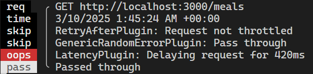
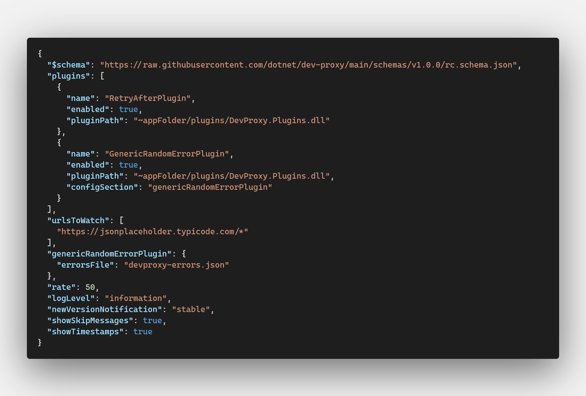
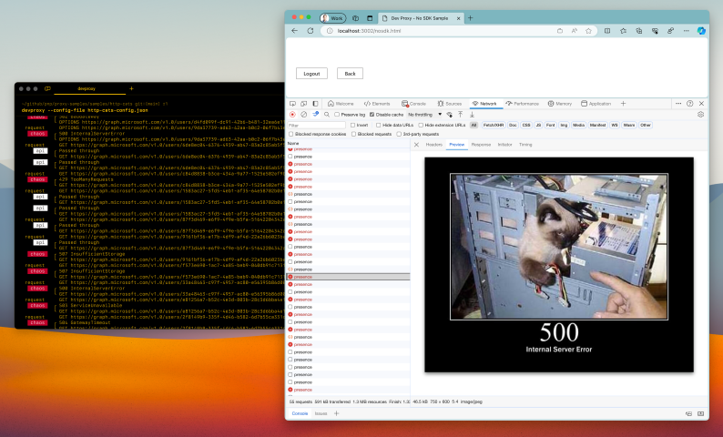

<!--
_class:
 - lead
 - invert
-->

# DevProxy

Dev Proxy is an API simulator that helps you effortlessly test your app beyond the happy path.

<!-- _paginate: skip -->

## Story

September 2025 CloudFlare outage on their Cloudflare Dashboard due to repeated calls to their own API - the cause was a useEffect without a dependency.

## What is Dev Proxy?

[Dev Proxy](https://learn.microsoft.com/en-us/microsoft-cloud/dev/dev-proxy/concepts/what-is-proxy) is a forward proxy that you can use to intercept and modify requests from your application to any target server. With Dev Proxy, you can:


## For and against (Pro et contra)

✅ Pros

- You can mock whatever backend scenario you want.
- Use whatever script or langauge you want.
- It was like it was never there - bypass the proxy to return to your regular behaviour.

❌ Cons

- Takes time to setup.
- Another dependency to install.
- Small learning curve.

## Use Cases

- **Simulate API errors** - on internal (ie. localhost) and external (ie. Microsoft Graph).
- **Add latency** to requests to so you can test your UI display loading data messages.
- Fire **rate limits** and **handle throttling** - test with the  `Retry-After` header.

---

- Stand up **mock APIs and data** - for when the backend is not ready yet
- **Intercept OpenAI-compatible requests** to [analyze costs](https://learn.microsoft.com/en-us/microsoft-cloud/dev/dev-proxy/how-to/understand-language-model-usage?tabs=aspire)
- Check if your API is making requests with **least permissions** with `API Center`

## Get Started

[...with Dev Proxy](https://youtu.be/HVTJlGSxhcw)
[](https://youtu.be/HVTJlGSxhcw) from the Dev Proxy Team

## Local Development

- ✅ Dev Proxy will set itself as the system proxy. You can run commands `Invoke-WebRequest` or `curl`.
- ℹ️ Chromium* based browsers (Edge/Chrome) bypass system proxy settings for localhost URLs - you need to exclude localhost URLs from the bypass list.

<sub>*See [documentation](https://learn.microsoft.com/en-us/microsoft-cloud/dev/dev-proxy/how-to/intercept-localhost-requests) for Firefox.</sub>


## How to run locally

Run this to test localhost

```pwsh
taskkill /f /im msedge.exe
cd "C:\Program Files (x86)\Microsoft\Edge\Application"
./msedge `
  --proxy-bypass-list="<-loopback>" `
  --proxy-server="127.0.0.1:8000"
```
 ⚠️ Save your work beforehand ⚠️

### Usage



<sub>How does your application handle
slow responses, rate limits and errors?</sub>

## Demonstration

<video controls='controls' width='80%' src='/video/devproxy_sample.mp4'></video>
[Watch demonstration](/video/devproxy_sample.mp4)


## Dev Proxy Toolkit

 [VSCode extension](https://marketplace.visualstudio.com/items?itemName=garrytrinder.dev-proxy-toolkit) is a wrapper to the CLI.

## Config

Open the VSCode command palette `CTRL+SHIFT+P` and 'Dev Proxy Toolkit: Create create configuration file'

Creates `.devproxy/devproxyrc.json`

---



## Plugins

Use [plugins](https://learn.microsoft.com/en-us/microsoft-cloud/dev/dev-proxy/technical-reference/overview) or make your own

- `Auth` - Simulates authentication and authorization using API keys or OAuth2.
- `CachingGuidancePlugin` - Shows a warning when Dev Proxy intercepted the same request within the specified period of time.
- `CrudApiPlugin` - Simulates a CRUD API with an in-memory data store.

---

- `EntraMockResponsePlugin` - Mocking auth flow API requests.
- `ExecutionSummaryPlugin` - Creates a summary of the requests that pass through the proxy.
- `MockGeneratorPlugin` - Generate mocks from the request.

---

- `MockRequestPlugin` - test webhooks in your client from dev proxy.
- `RateLimitingPlugin` - Simulates rate-limit behaviors.
- `RewritePlugin` - use rewrite rules - test example.com vs example.local
- `UrlDiscoveryPlugin` - creates a list of requested URLs.
- ... and much more (including your own)

### 🔍 Mock and CRUD Plugin

*Return fixed data when your backend is not ready*

- Different data on `nth` request
- Can deliver binary data
- Create a mock CRUD API - mutates in memory and resets on restart.
- Access via `devtunnel` over the internet - have your cloud apps connect to your machine.
- Supports Microsoft Entra

## Samples

[github.com/pnp/proxy-samples](https://github.com/pnp/proxy-samples)



- [http cats](https://github.com/pnp/proxy-samples/tree/main/samples/http-cats) - return cat images when simulating erroneous HTTP status codes for Microsoft Graph.

## CloudFlare

What about the CloudFlare outage and how could Dev Proxy have helped in this situation? The plugin `CachingGuidancePlugin` could have been run on the developers machine and they would have seen that the API was getting called too frequently.

## Resources
<!-- _paginate: skip -->

🔗 View Online [neave.dev/devproxy](https://neave.dev/devproxy)

⬇️ Download [PowerPoint](https://neave.dev/devproxy/devproxy.pptx) and [PDF](https://neave.dev/devproxy/devproxy.pdf)

📝 Contribute on [ GitHub](https://github.com/peterneave/devproxy)
