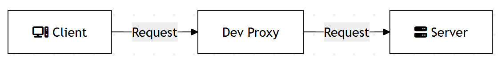

<!--
_class:
 - lead
 - invert
-->

# DevProxy

Dev Proxy is an API simulator that helps you effortlessly test your app beyond the happy path.

<!--fit-->
<!-- _paginate: skip -->

## Foreword
<!-- _paginate: skip -->

📝 Contribute on [ GitHub](https://github.com/peterneave/devproxy)

🔗 View Online [neave.dev/devproxy](https://neave.dev/devproxy)

⬇️ Download [PowerPoint](https://neave.dev/devproxy/devproxy.pptx) and [PDF](https://neave.dev/devproxy/devproxy.pdf)

## What is Dev Proxy?

Dev Proxy is an API simulator that helps you effortlessly test your app beyond the happy path.


[What is a proxy?](https://learn.microsoft.com/en-us/microsoft-cloud/dev/dev-proxy/concepts/what-is-proxy)

## Use Cases

- Create API errors - on internal (ie. localhost) and external (ie. Microsoft Graph).
- Add latency and have the UI display loading data messages.
- Fire rate limits and handle throttling - does your app handle `Retry-After` header?

---

- Stand up mock APIs - for when the backend is not ready yet
- Intercept OpenAI-compatible requests to [analyze costs](https://learn.microsoft.com/en-us/microsoft-cloud/dev/dev-proxy/how-to/understand-language-model-usage?tabs=aspire)
- Check if your API is making requests with least permissions with `API Center`

## Get Started

[](https://youtu.be/HVTJlGSxhcw)

## Local Development

✅ Dev Proxy will set itself as the system proxy. You can run commands Invoke-WebRequest or curl.

ℹ️ Chromium based browsers (Edge/Chrome) bypass system proxy settings for localhost URLs - you need to exclude localhost URLs from the bypass list.

See [documentation](
https://learn.microsoft.com/en-us/microsoft-cloud/dev/dev-proxy/how-to/intercept-localhost-requests) for more information and how to use with Firefox.

---

Run this - ⚠️ save your work beforehand

```sh
taskkill /f /im msedge.exe
cd "C:\Program Files (x86)\Microsoft\Edge\Application"
msedge --proxy-bypass-list="<-loopback>" --proxy-server="127.0.0.1:8000"
```

## Dev Proxy Toolkit

 [VSCode extension](https://marketplace.visualstudio.com/items?itemName=garrytrinder.dev-proxy-toolkit)

## Config

Open the VSCode command palette `CTRL+SHIFT+P` and 'Dev Proxy Toolkit: Create create configuration file'

Creates `.devproxy/devproxyrc.json`

---


### Running


How does your application handle slow responses, rate limits and errors?

## Plugins

- `Auth` - Simulates authentication and authorization using API keys or OAuth2.
- `CachingGuidancePlugin` - Shows a warning when Dev Proxy intercepted the same request within the specified period of time.
- `CrudApiPlugin` - Simulates a CRUD API with an in-memory data store.

---

- `EntraMockResponsePlugin` - Mocking auth flow API requests.
- `ExecutionSummaryPlugin` - Creates a summary of the requests that pass through the proxy.
- `MockGeneratorPlugin` - Generate mocks from the request.

---

- `MockRequestPlugin` - test webhooks in your client from dev proxy.
- `RateLimitingPlugin` - Simulates rate-limit behaviors.
- `RewritePlugin` - use rewrite rules - test example.com vs example.local
- `UrlDiscoveryPlugin` - creates a list of requested URLs.
- ... and much more

### Mock

Return fixed data when your backend is not ready

- Different data on nth request
- Binary data
- Create a mock CRUD API
  - Access via `devtunnel` over the internet
  - Supports Microsoft Entra
